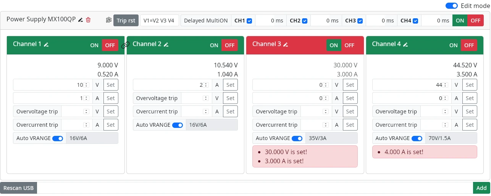

# Power supply control
Power supply control desktop GUI written in Dioxus for AIM-TTI MX100QP over USB UART.




## Build & Run
```shell-session
$ cargo run
```

Increase logging level via `RUST_LOG=trace` environment variable.

## Testing with arduino stub
Flash `MX100QP/MX100QP.ino` into your arduino for testing with fake device if you dont have real power supply.

```
$ ./MX100QP/flash.sh /dev/ttyACM0
```
